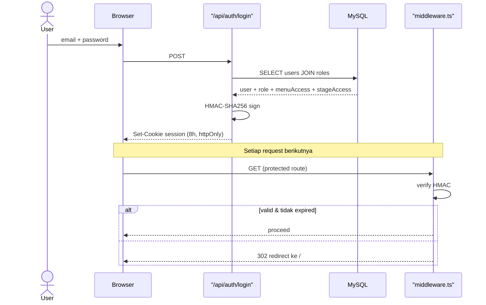
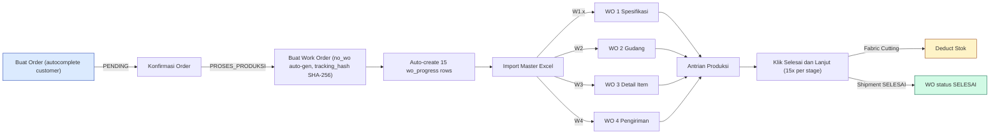
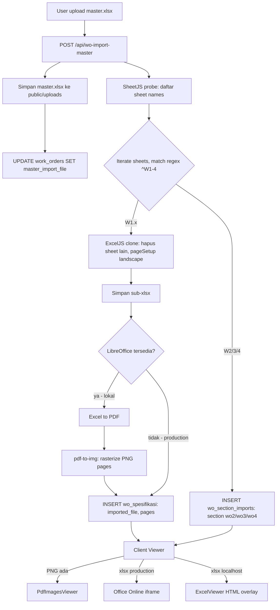
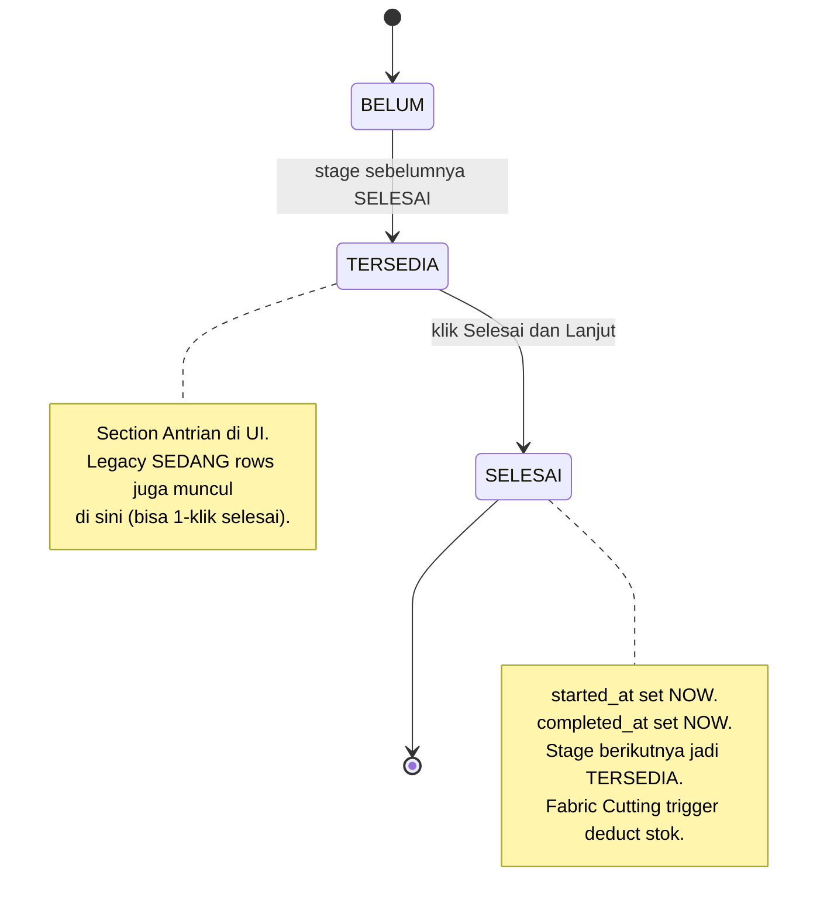
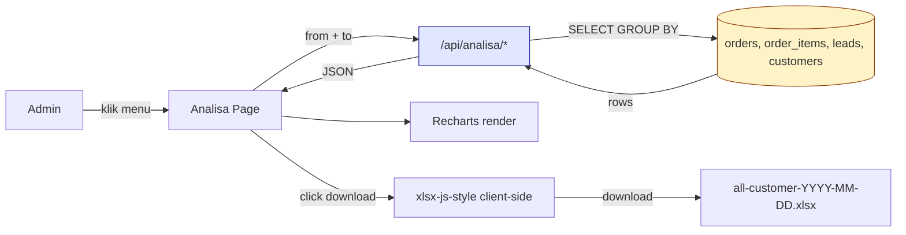
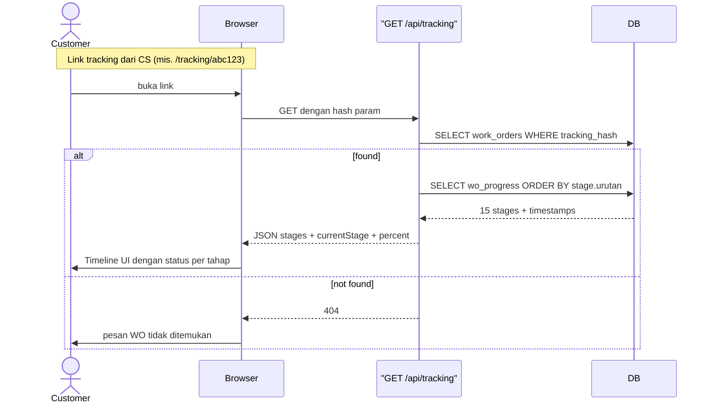
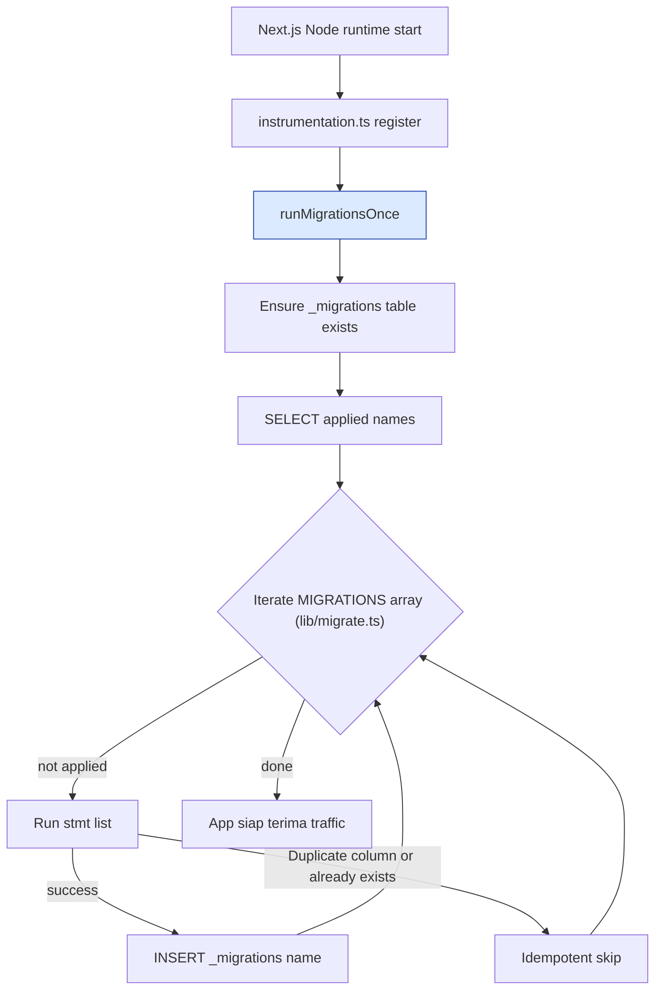

# AYRES CRM — Sistem Manajemen Produksi Apparel

Sistem CRM + manajemen produksi berbasis web untuk bisnis manufaktur apparel/jersey (**AYRES Pattern Lab / AYRES Apparel**).
Mengelola alur end-to-end: **lead → order → work order → 15 tahap produksi → pengiriman**, plus analitik penjualan/leads, tracking publik untuk customer, dan RBAC granular.

Deployed at **[crm.ayreslab.id](https://crm.ayreslab.id)** (Hostinger managed Node.js hosting).

---

## Daftar Isi

1. [Tech Stack](#tech-stack)
2. [Arsitektur Sistem](#arsitektur-sistem)
3. [Fitur Utama](#fitur-utama)
4. [Flow Diagrams](#flow-diagrams)
5. [Role & Akses](#role--akses)
6. [Database](#database)
7. [API Reference](#api-reference)
8. [Auto-Migration](#auto-migration)
9. [Setup Lokal](#setup-lokal)
10. [Deployment (Hostinger)](#deployment-hostinger)
11. [Struktur Proyek](#struktur-proyek)
12. [Logika Bisnis](#logika-bisnis)
13. [Tema (Dark/Light Mode)](#tema-darklight-mode)
14. [Troubleshooting](#troubleshooting)
15. [License](#license)

---

## Tech Stack

| Layer | Teknologi | Versi | Peran |
|-------|-----------|-------|-------|
| Framework | Next.js (App Router) | 16.1.6 | Server + SPA hybrid |
| UI | React | 19.2.3 | Component tree |
| Language | TypeScript | 5.x | Strict types |
| Styling | Tailwind CSS | 4.x | Utility CSS + `[data-theme]` overrides |
| Database | MySQL / MariaDB | via `mysql2/promise` 3.20 | Data persistence |
| Auth | HMAC-SHA256 signed cookie | — | Session (8h TTL, httpOnly) |
| Charts | Recharts | 3.8 | Analytics visualisasi |
| Excel export | `xlsx-js-style` | 1.2 | Client-side styled xlsx |
| Excel parse | `xlsx` + `exceljs` | 0.18 / 4.4 | Parse + preserve images |
| PDF generate | `jspdf` + `jspdf-autotable` | 4.2 / 5.0 | Fallback WO PDF |
| PDF rasterize | `pdf-to-img` + `pdfjs-dist` | 6.1 / 5.7 | Excel→PDF→PNG (local dev) |
| Excel→PDF | `libreoffice-convert` | 1.8 | Lokal dev only (butuh LibreOffice) |
| Canvas | `html2canvas` | 1.4 | DOM → PNG untuk PDF |

---

## Arsitektur Sistem

```mermaid
flowchart TB
    subgraph Browser
        UI[React 19 Components]
        Auth[AuthProvider]
        Theme[ThemeProvider]
        Toast[Toast System]
        UI -.-> Auth & Theme & Toast
        UI --> APIClient[lib/api-db.ts]
    end

    subgraph NextJS[Next.js 16 Server]
        MW[middleware.ts<br/>HMAC session verify]
        subgraph Routes[Protected Routes]
            Dash["/dashboard"]
            Orders["/orders"]
            WO["/work-orders"]
            Prod["/produksi"]
            Ana["/analisa/*"]
            Mstr["/master"]
        end
        subgraph APIs[API Routes]
            AuthAPI["/api/auth/*"]
            DBAPI["/api/db/&#91;table&#93;"]
            Analytics["/api/analisa/*"]
            Upload["/api/wo-import-master"]
            Track["/api/tracking"]
        end
        Inst[instrumentation.ts<br/>auto-migration on boot]
    end

    subgraph Storage
        MySQL[("MySQL 8+")]
        FS["public/uploads (master xlsx + png pages)"]
    end

    subgraph External
        MSOffice["view.officeapps.live.com (WO 1 render production)"]
        Wilayah["emsifa API (provinsi/kab/kec/desa)"]
    end

    Browser -->|fetch| MW
    MW -->|valid session| Routes
    MW -->|valid session| APIs
    APIs -->|mysql2| MySQL
    Upload -->|write| FS
    Inst -->|run pending| MySQL
    UI -->|iframe embed| MSOffice
    UI -->|fetch| Wilayah
```



**Prinsip inti:**
- **Zero direct DB from client** — semua query lewat `/api/db/[table]` yang punya whitelist tabel + kolom filter (SQL injection-safe).
- **Session HMAC** — cookie ditandatangani signature; middleware verifikasi setiap request ke `(protected)/*`.
- **Auto-migration** — migrasi SQL embedded di TypeScript, dijalankan otomatis saat server boot (production self-healing).
- **Read-only analytics** — API `/api/analisa/*` cuma `SELECT`, tidak pernah menyentuh data existing.

---

## Fitur Utama

### 🔐 Auth & Session
- Login email + password
- **Password disimpan plain-text** di kolom `users.password` (internal-use CRM, bukan public-facing). Untuk expose publik, wajib upgrade ke bcrypt/argon2 di `/api/auth/login/route.ts`
- Session cookie HMAC-SHA256 (`lib/session.ts`), 8-jam TTL, httpOnly, `SameSite=Lax`, secure flag di production
- `middleware.ts` gate seluruh route `(protected)/*` dan API di luar `/api/auth/login` + `/api/tracking`
- Role dinamis: `admin` / `cs` / `produksi` — mapping fuzzy dari role name via `mapRole()`; `is_super_admin=1` selalu → `admin`
- Super admin bypass menu access check (menuAccess di-hardcode di login route)

### 📊 Dashboard (`/dashboard`)
- **5 KPI card**: Total Pendapatan · Customer Orders · Pending · WO Aktif · WO Terlambat
- **Peringatan Deadline** — horizontal scrollable card list, WO overdue di-highlight
- **Work Order Terbaru** — tabel 5 WO teratas dengan status badge
- Truncate + tooltip untuk currency panjang (Rp 460.247.220)

### 📝 Orders (`/orders`)
- **Buat Order Baru (Drawer)**:
  - **Autocomplete Nama Customer** — search dari master `customers`, klik suggestion auto-fill nama, alamat, no HP
  - Wilayah Indonesia bertingkat (Provinsi → Kab/Kota → Kecamatan → Desa via emsifa API)
  - Multi-item order (paket × qty)
  - Detail Bahan editable (8 bagian default: FRONT BODY, BACK BODY, SLEEVE, dst)
  - Nominal Order + DP Desain + DP Produksi (Kekurangan auto-computed)
  - Attach Promo (many-to-many)
  - **Validasi wajib**: Nama Customer, Alamat Lengkap, No HP, Leads, Item Order (min 1 paket + qty), Tanggal Order
  - Field wajib ditandai `*` merah — validasi collect semua error di 1 toast
- **Tabel Orders**: search + filter status + pagination
- **Detail Order** (`/orders/[id]`): edit customer info, items, pembayaran, promo, detail bahan
- Dropdown paket/bahan **auto-sorted A-Z** (localeCompare)

### 🛠️ Work Orders (`/work-orders`)
- **No WO auto-generated** dari WO tertinggi + 1 (format `WOMMDD-NNN`, mis. `WO0623-002`)
- **Tracking hash SHA-256** — URL tracking berupa hash, bukan `no_wo` mentah → tidak bisa di-guess
- Auto-create `wo_progress` untuk 15 tahap (stage pertama `TERSEDIA`, sisanya `BELUM`)
- Detail WO (`/work-orders/[id]`) dengan **5 tab**:
  - **Detail** — customer info + BAHAN table + progress bar
  - **WO 1** — Lembar Spesifikasi (file-based)
  - **WO 2** — Form Permintaan Gudang (file-based)
  - **WO 3** — Detail Order Items per pemain (file-based)
  - **WO 4** — Checklist Pengiriman (file-based)

**Import Master Excel** — upload 1 file xlsx yang otomatis distribusi per-sheet:

| Nama Sheet | Target Tab | Multi? |
|---|---|---|
| `W1.1`, `W1.2`, `W1.n` | WO 1 (multi spec) | ✅ |
| `W2` | WO 2 | first wins |
| `W3` | WO 3 | first wins |
| `W4` | WO 4 | first wins |

Detail panduan: `PANDUAN_UPLOAD_MASTER_EXCEL.md`.

**Rendering WO 1** (dengan gambar embedded desain):
- **Lokal dev**: Excel → LibreOffice CLI → PDF → `pdf-to-img` → PNG pages (fidelity penuh)
- **Production Hostinger**: LibreOffice tidak tersedia → fallback ke **Microsoft Office Online iframe embed** (`view.officeapps.live.com`), gambar render identik dengan Excel
- **Localhost tanpa LibreOffice**: fallback ke SheetJS + ExcelJS overlay (HTML + absolute-positioned images)

**Header actions per WO detail**:
- `Import Master Excel` (upload)
- `Download All` — download file master xlsx asli (kalau ada), fallback ke combined PDF WO 1-4
- `Delete All` — hapus semua import + clear master file URL

### 🏭 Produksi (`/produksi`) — 1-Click Flow

15 tahap produksi (Approval Design, Approval Pattern, Proofing, Printing Layout, Approval Layout, Printing Process, Sublim Press, QC Panel Process, Fabric Cutting, QC Cutting, Sewing, QC Jersey, Steam Jersey, Finishing, Shipment).

- **Tab navigation** per stage dengan badge jumlah antrian
- **Section "Antrian {stage}"** — semua WO yang `TERSEDIA` atau `SEDANG` (legacy) di stage tersebut
- **Tombol `Selesai & Lanjut`** — 1 klik langsung:
  1. Mark stage saat ini `SELESAI` (both `started_at` + `completed_at`)
  2. Advance stage berikutnya ke `TERSEDIA`
  3. Update `work_orders.current_stage_id`
- **Fabric Cutting** trigger `/api/wo/deduct-stok` — kurangi stok sesuai detail bahan; rollback ke `TERSEDIA` kalau stok tidak cukup
- **Stage terakhir (Shipment)** selesai → WO `status = 'SELESAI'`
- **Role-based stage access** via `role_stage_access` — user hanya bisa manage stage yang di-assign; stage lain read-only

### 📊 Monitoring Produksi (`/monitoring-produksi/*`)
3 sub-page (currently coming soon):
- **Monitoring Print Fedar**
- **Monitoring Perbanyak**
- **Proofing**

### 📈 Analisa (`/analisa/*`)

**Grafik** (`/analisa/grafik`):
- **DateRangePicker** (default 30 hari terakhir, quick filter Hari Ini/7/30 hari)
- 4 stat card: Total Order · Total Qty · Paket Terlaris · Provinsi Terbanyak
- Chart 1: **Penjualan per Paket** (horizontal bar, top 12)
- Chart 2: **Customer per Provinsi** (horizontal bar dengan label qty · customer count)
- Tabel detail semua provinsi

**All Customer** (`/analisa/all-customer`):
- Tabel data lengkap semua order (12 kolom: No Order, Tanggal, Nama, HP, Alamat, Desa, Kecamatan, Kabupaten, Provinsi, Items, Qty, Nominal Order)
- Search global (nama, HP, wilayah, no order, paket)
- Pagination 25 per page
- **Download Excel** — client-side generate via `xlsx-js-style`, header bold + width tuned, hasil = filter aktif

**Grafik CS** (`/analisa/grafik-cs`):
- 4 stat card + DateRangePicker
- **1 stacked horizontal bar chart** — tiap bar = paket, segmen warna = breakdown per leads source
- Legend di atas + custom tooltip breakdown
- Tabel leads dengan color marker (Nama Leads, Jenis CS, Qty, Order, Customer)

### 📈 Laporan (`/laporan/*`)
- **Laporan Produksi** — statistik per tahap dengan date-range
- **Laporan Penggunaan Bahan** — konsumsi material per periode

### 📦 Stok (`/stok`)
- Tab Stok Aktual + Stok Adjustment
- Auto-deduction saat WO Fabric Cutting selesai

### 📚 Master (`/master`)
10 entitas full CRUD: Customer · Paket · Barang · Tipe Barang · Ukuran · Pecah Pola · Jabatan · Karyawan · Promo · Leads

### ⚙️ Setting (`/setting`)
- User + role management
- Menu access checklist per role (10 menu)
- Stage access checklist per role (15 tahap)

### 🌐 Tracking Publik (`/tracking/[hash]`)
- Halaman customer-facing (no login), background beige `#f5f1ea` (selalu light theme)
- Timeline 15 tahap dengan indicator SELESAI (hijau) / Sedang dikerjakan (amber) / belum (abu)
- Info WO: no order, customer, paket, jumlah, deadline
- URL hash-based (SHA-256) — tidak bisa di-guess dari nomor WO

### 🌓 Theme Toggle
- Dark (default) & Light mode
- `[data-theme]` attribute di `<html>` + CSS overrides comprehensive di `globals.css`
- Login page **selalu dark** (design cosmic/glow), Tracking page **selalu light** (customer-facing) — scoped via `.login-page` dan `.tracking-page` class

---

## Flow Diagrams

### 1. Auth & Session



### 2. Order → Work Order → Produksi → Shipment



### 3. Master Excel Import Flow



### 4. Produksi 1-Click Flow



### 5. Analytics Data Flow (Read-Only)



### 6. Tracking Customer Flow



### 7. Auto-Migration Bootstrap



Migrasi juga dijalankan **lazy** dari `lib/db.ts` sebelum query pertama, jadi kalau instrumentation gagal, first request tetap trigger migration.

---

## Role & Akses

### Matrix Akses Fitur

| Fitur | Admin / Super Admin | CS | Produksi |
|---|:---:|:---:|:---:|
| Login redirect | `/dashboard` | `/orders` | `/produksi` |
| Dashboard (KPI + peringatan deadline) | ✅ | ❌ auto-redirect | ❌ auto-redirect |
| Orders — lihat list | ✅ | ✅ | ✅ (read-only) |
| Orders — tombol create | ✅ "Order Baru" (biru) | ✅ "Input Order" (indigo) | ❌ |
| Orders — Export PDF (2 mingguan / bulanan) | ✅ | ❌ | ❌ |
| Order Detail — edit customer, items, DP, promo | ✅ | ✅ | ❌ |
| Work Orders — list + detail | ✅ | ✅ | ✅ (read-only) |
| WO — Import Master Excel | ✅ | ✅ | ✅ |
| WO — Download All / Delete All | ✅ | ✅ | ✅ |
| Produksi (kanban 15 tahap) | ✅ semua stage | ❌ | ✅ per `role_stage_access` |
| Produksi — button "Selesai & Lanjut" | ✅ | ❌ | ✅ (hanya stage yang di-assign) |
| Monitoring Produksi (3 submenu) | ✅ | ❌ | ❌ |
| Analisa — Grafik, All Customer, Grafik CS | ✅ | ❌ | ❌ |
| Laporan — Produksi, Penggunaan Bahan | ✅ | ❌ | ❌ |
| Stok — Aktual + Adjustment | ✅ | ❌ | ❌ |
| Master Data (10 entitas) | ✅ | ❌ | ❌ |
| Setting — user + role + akses | ✅ | ❌ | ❌ |

### Detail per Role

**Admin / Super Admin** (`role_nama` contains "admin" atau `is_super_admin=1`)
- Login → `/dashboard`
- Super Admin: menuAccess di-hardcode full list di `app/api/auth/login/route.ts`, `stageAccess=[]` (interpretasi: semua stage)
- Admin biasa: menuAccess dari `role_menu_access`, stageAccess dari `role_stage_access` (bisa dibatasi via `/setting`)
- Full CRUD ke semua master data, orders, work orders, produksi stages
- Satu-satunya role yang bisa buka **Analisa**, **Monitoring Produksi**, **Laporan**, **Stok**, **Master**, **Setting**

**CS** (`role_nama` contains "cs" atau "customer")
- Login → `/orders` (guard di `/dashboard` bounce back ke `/orders`)
- Bisa **input & edit order** (tombol "Input Order" indigo)
- Bisa upload Master Excel per WO (WO detail page tidak role-check)
- **Tidak bisa** update stage produksi, akses analitik, master data, stok, laporan, setting
- Sidebar menampilkan hanya menu-menu yang di-assign di `role_menu_access` (biasanya: Orders + Work Orders)

**Produksi** (`role_nama` contains "produksi")
- Login → `/produksi` (guard di `/dashboard` bounce ke `/produksi`)
- Halaman utama: kanban 15 tahap dengan filter berdasarkan `stageAccess`
- Bisa klik "Selesai & Lanjut" **hanya di stage yang di-assign** (contoh: karyawan Sewing hanya lihat aktif di stage Sewing; stage lain read-only dengan icon gembok)
- Bisa lihat Orders + Work Orders (read-only untuk konteks) tapi tidak bisa create/edit order
- `stageAccess` kosong = akses semua stage (super admin behavior)

### Cara Mengubah Akses Role
1. Buka `/setting` (admin only)
2. Pilih role → checklist menu di section "Menu Access" (10 menu: Dashboard, Orders, Work Orders, Produksi, Monitoring Produksi, Laporan, Stok, Settings, Master Data, Analisa)
3. Checklist stage di section "Stage Access" (15 tahap produksi)
4. Save → user dengan role tersebut harus logout+login ulang agar cookie session dapat menuAccess/stageAccess baru

---

## Database

Schema di **`database/ayres_crm.sql`** + auto-migrations di **`lib/migrate.ts`**.

### Grouping Tabel (29 aplikasi + `_migrations` auto)

**Auth & RBAC (4)**
`roles` · `users` · `role_menu_access` · `role_stage_access`

**Master Data (10)**
`customers` · `paket` · `barang` · `tipe_barang` · `ukuran` · `pecah_pola` · `jabatan` · `karyawan` · `promo` · `leads`

**Order (4)**
`orders` · `order_items` · `order_detail_bahan` · `order_promos`

**Work Order (8)**
`work_orders` · `wo_progress` · `wo_spesifikasi` · `wo_spesifikasi_bahan` · `wo_permintaan_gudang` · `wo_detail_items` · `wo_pengiriman` · **`wo_section_imports`** (migration 006, untuk WO 2/3/4 imports)

**Produksi & Inventaris (3)**
`production_stages` · `stok` · `stok_adjustment`

**Config (2)**
`settings` · `_migrations` (auto-generated, tracking applied migrations)

### Migrations Terapkan (embedded di `lib/migrate.ts`)

| # | Nama | Isi |
|---|---|---|
| 002 | `wo_spesifikasi_paket` | ADD `paket` VARCHAR(100) |
| 003 | `work_orders_tracking_hash` | ADD `tracking_hash` VARCHAR(64) UNIQUE + backfill `SHA2(no_wo, 256)` + update orders.tracking_link |
| 004 | `wo_spesifikasi_imported_file` | ADD `imported_file` LONGTEXT, `imported_file_name` VARCHAR(255) |
| 005 | `wo_spesifikasi_imported_file_pages` | ADD `imported_file_pages` TEXT |
| 006 | `wo_section_imports` | CREATE TABLE untuk WO 2/3/4 imports |
| 007 | `work_orders_master_import` | ADD `master_import_file` + `master_import_file_name` |

Semua migrations **idempotent-safe** — error "Duplicate column"/"already exists" ditolerir. Cocok untuk redeploy berulang tanpa risiko.

### Status Enums

| Enum | Values |
|---|---|
| `orders.status` | `PENDING`, `CONFIRMED`, `IN_PROGRESS`, `DONE`, `CANCELLED` |
| `work_orders.status` | `PENDING`, `PROSES_PRODUKSI`, `SELESAI`, `TERLAMBAT` |
| `wo_progress.status` | `BELUM`, `TERSEDIA`, `SEDANG` (legacy), `SELESAI` |
| `wo_permintaan_gudang.kategori` | `BAHAN_UTAMA`, `AKSESORIS`, `MATERIAL_TAMBAHAN` |
| `stok_adjustment.tipe` | `Penambahan`, `Pengurangan`, `Koreksi`, `Pemakaian_WO` |
| `barang.satuan` | `PCS`, `KILOGRAM`, `METER`, `ROLL`, `LUSIN` |
| `users.status` | `aktif`, `non-aktif` |
| `leads.sumber` | `Instagram`, `WhatsApp`, `Facebook`, `Referral`, `Website`, `Lainnya` |
| `leads.jenis_cs` | `CS Eksternal`, `Reseller`, `Agen` |

---

## API Reference

Semua API di `app/api/`. Middleware memproteksi kecuali `/api/auth/login` dan `/api/tracking`.

### Auth
| Endpoint | Method | Fungsi |
|---|---|---|
| `/api/auth/login` | POST | Login → session cookie |
| `/api/auth/logout` | POST | Clear session |
| `/api/auth/session` | GET | Get current user |

### Generic Data
| Endpoint | Method | Fungsi |
|---|---|---|
| `/api/db/[table]` | GET | List rows (whitelist tabel + search + filter cols) |
| `/api/db/[table]` | POST | Insert row |
| `/api/db/[table]` | PUT | Update row `{ id, ...fields }` |
| `/api/db/[table]` | DELETE | Delete row `?id=N` |

Whitelist di `app/api/db/[table]/route.ts` mendefinisikan `searchCols` dan `filterCols` per tabel — kolom dari user input dipakai HANYA kalau ada di whitelist (SQL-injection safe).

### File & Excel
| Endpoint | Method | Fungsi |
|---|---|---|
| `/api/upload` | POST | Upload umum ke `public/uploads/` |
| `/api/wo-import-master` | POST | Upload master xlsx → distribusi per-sheet ke WO 1-4 |
| `/api/rasterize-pdf` | POST | On-demand PDF → PNG rasterization (legacy PDF specs) |

### Produksi
| Endpoint | Method | Fungsi |
|---|---|---|
| `/api/wo/deduct-stok` | POST | Kurangi stok saat Fabric Cutting selesai; return `insufficient` array kalau kurang; write ke `stok_adjustment` dengan tipe `Pemakaian_WO`; idempoten via `deducted_at` |
| `/api/wo/update-status` | POST | Update WO status manual, cascade ke `orders.status` (`DONE` bila semua WO SELESAI, `IN_PROGRESS` bila ada yang PROSES_PRODUKSI) |

### Analytics (semua read-only)
| Endpoint | Method | Fungsi |
|---|---|---|
| `/api/analisa/grafik` | GET | Aggregation paket + provinsi (with `?from&to`) |
| `/api/analisa/all-customer` | GET | Semua order + items per order |
| `/api/analisa/grafik-cs` | GET | Aggregation paket + leads + paket×leads matrix |

### Tracking (publik)
| Endpoint | Method | Fungsi |
|---|---|---|
| `/api/tracking` | GET | `?hash=` atau `?no_wo=` → progress WO + orders info |

### Client helper `lib/api-db.ts`
```ts
import { dbGet, dbCreate, dbUpdate, dbDelete } from '@/lib/api-db';

const rows = await dbGet('orders', 'search-query', { status: 'PENDING' });
const newId = await dbCreate('orders', { customer_nama: '...', ... });
await dbUpdate('orders', id, { status: 'SELESAI' });
await dbDelete('orders', id);
```

---

## Auto-Migration

Sistem migrasi **tanpa perlu buka phpMyAdmin di production**.

### Mekanisme
1. **`instrumentation.ts`** — Next.js hook yang jalan sekali saat Node runtime start:
   ```ts
   export async function register() {
     if (process.env.NEXT_RUNTIME !== 'nodejs') return;
     const { runMigrationsOnce } = await import('./lib/migrate');
     await runMigrationsOnce();
   }
   ```
2. **`lib/db.ts`** — lazy fallback: sebelum query pertama, `ensureMigrated()` trigger migrasi kalau belum jalan.
3. **`lib/migrate.ts`** — array `MIGRATIONS` berisi SQL statements as string literals (embedded, bukan baca dari filesystem — supaya build production include migrations tanpa perlu ship folder migrations).

### Add Migration Baru
Edit `lib/migrate.ts` → append entry di akhir array:
```ts
{
  name: '008_add_something',
  up: [
    "ALTER TABLE ...",
    "CREATE INDEX ...",
  ],
},
```
Deploy → migration otomatis apply, tercatat di `_migrations` table, tidak akan re-run.

**Idempotency**: error yang match `/Duplicate column|already exists|Duplicate key/i` di-swallow (aman kalau column sudah ada karena rollback partial atau manual apply).

---

## Setup Lokal

### 1. Prasyarat
- **Node.js 20+** dan npm
- **MySQL 8.0+** atau MariaDB 10.11+
- (Opsional) **LibreOffice** — untuk render WO 1 xlsx → PDF → PNG di dev

### 2. Clone & Install
```bash
git clone https://github.com/EzraNahumury/web_crm.git
cd web_crm
npm install
```

### 3. Database
```bash
mysql -u root -p -e "CREATE DATABASE ayres_crm CHARACTER SET utf8mb4 COLLATE utf8mb4_general_ci;"
mysql -u root -p ayres_crm < database/ayres_crm.sql
```

Migrasi berikutnya auto-apply saat `npm run dev` / `npm start`.

### 4. Environment (`.env.local`)
```env
DB_HOST=localhost
DB_PORT=3306
DB_USER=root
DB_PASSWORD=
DB_NAME=ayres_crm

SESSION_SECRET=random-string-min-32-chars

# nomor WA admin/CS yang tampil di button "Hubungi via WhatsApp"
# di halaman tracking customer. Format: 62812xxxx atau 0812xxxx.
# Kalau kosong, tombol WA disembunyikan.
# Bisa juga di-set via row settings key_name='admin_whatsapp' di DB
# (row DB menang atas env var — bisa di-edit tanpa restart).
ADMIN_WHATSAPP=

# opsional — kalau ingin CloudConvert fallback WO 1
CLOUDCONVERT_API_KEY=
```

### 5. Run
```bash
npm run dev            # http://localhost:3000
npm run build          # production build
npm run start          # production server
npm run lint           # ESLint
```

### 6. Login pertama
Cek `INSERT INTO users` di `database/ayres_crm.sql`. Ganti password via `/setting` → user edit.

---

## Deployment (Hostinger)

Production ini di-hosting di **Hostinger Managed Node.js** (bukan VPS). Konsekuensi:

### Yang bisa dilakukan
- Deploy via Git auto-deploy dari GitHub (push ke `main` → auto redeploy)
- MySQL managed
- HTTPS otomatis (Let's Encrypt)
- `public/uploads/` writable (perlu chmod 755 sekali di File Manager hPanel)

### Yang tidak bisa dilakukan
- Install package OS (LibreOffice, ImageMagick, poppler, dll)
- Custom systemd service
- SSH kadang perlu upgrade paket

### Konsekuensi arsitektur
1. **WO 1 rendering** — LibreOffice tidak jalan → **fallback ke Microsoft Office Online iframe embed** yang render xlsx dari domain public. Hostinger memang publik-serve `/uploads/`, jadi MS bisa fetch file kita.
2. **Persistensi upload** — folder `public/uploads/` diluar `.gitignore`. Kalau perlu file survive lintas deploy, pastikan tidak overwrite via build script.
3. **Auto-migration** — deploy dari GitHub akan restart Node → `instrumentation.ts` trigger `runMigrationsOnce` → schema self-heal.

### Env vars di Hostinger
Set di **hPanel → Advanced → Node.js → Environment Variables**:
- `DB_HOST`, `DB_PORT`, `DB_USER`, `DB_PASSWORD`, `DB_NAME`
- `SESSION_SECRET`
- (opsional) `CLOUDCONVERT_API_KEY` — jika suatu saat perlu render Excel identik dengan LibreOffice di production tanpa iframe

---

## Struktur Proyek

```
web_crm/
├── app/
│   ├── layout.tsx                          Root — AuthProvider + ThemeProvider
│   ├── globals.css                         Tailwind + [data-theme] overrides
│   ├── page.tsx                            Login page (selalu dark)
│   ├── tracking/
│   │   └── [noWorkOrder]/page.tsx          Public customer tracking (selalu light)
│   ├── (protected)/
│   │   ├── layout.tsx                      Sidebar + collapsible parent menus
│   │   ├── dashboard/page.tsx
│   │   ├── orders/
│   │   │   ├── page.tsx
│   │   │   ├── [id]/page.tsx               Order detail + edit
│   │   │   └── create-order-drawer.tsx     Drawer dengan autocomplete customer
│   │   ├── work-orders/
│   │   │   ├── page.tsx
│   │   │   └── [id]/page.tsx               5-tab detail + Import Master Excel
│   │   ├── produksi/page.tsx               1-click flow
│   │   ├── monitoring-produksi/
│   │   │   ├── _coming-soon.tsx            Shared placeholder
│   │   │   ├── print-fedar/page.tsx
│   │   │   ├── perbanyak/page.tsx
│   │   │   └── proofing/page.tsx
│   │   ├── laporan/
│   │   │   ├── date-range-picker.tsx       Shared with analisa
│   │   │   ├── produksi/page.tsx
│   │   │   └── penggunaan-bahan/page.tsx
│   │   ├── analisa/
│   │   │   ├── grafik/page.tsx             Paket + Provinsi charts
│   │   │   ├── all-customer/page.tsx       Table + Excel download
│   │   │   └── grafik-cs/page.tsx          Stacked Paket × Leads
│   │   ├── stok/page.tsx
│   │   ├── master/page.tsx                 10 entitas tab-switcher
│   │   └── setting/page.tsx                User + role + access matrix
│   └── api/
│       ├── auth/{login,logout,session}/route.ts
│       ├── db/[table]/route.ts             Whitelisted CRUD
│       ├── analisa/
│       │   ├── grafik/route.ts
│       │   ├── all-customer/route.ts
│       │   └── grafik-cs/route.ts
│       ├── wo-import-master/route.ts       Master xlsx distributor
│       ├── wo/deduct-stok/route.ts
│       ├── upload/route.ts
│       ├── rasterize-pdf/route.ts
│       ├── roles/route.ts
│       └── tracking/route.ts
├── lib/
│   ├── db.ts                               MySQL pool + ensureMigrated
│   ├── migrate.ts                          MIGRATIONS array + runner
│   ├── auth-context.tsx                    useAuth hook
│   ├── theme-context.tsx                   useTheme hook
│   ├── api-db.ts                           dbGet/dbCreate/dbUpdate/dbDelete
│   ├── api.ts                              DB row → UI type mappers
│   ├── session.ts                          HMAC sign/verify
│   ├── hash.ts                             sha256Hex helper (tracking_hash)
│   ├── cache.ts                            sessionStorage cache (30s TTL)
│   ├── toast.tsx                           Toast provider + useToast
│   ├── constants.ts                        Stage labels & metadata
│   ├── types.ts                            Shared interfaces
│   └── utils.ts                            formatDate, computeAllocations, dll
├── database/
│   └── ayres_crm.sql                       Full schema + seed
├── public/
│   ├── logo/                               Brand assets
│   └── uploads/                            User uploads (writable in prod)
├── middleware.ts                           HMAC session gate
├── instrumentation.ts                      Auto-migration on boot
├── next.config.ts                          serverExternalPackages + body size
├── PANDUAN_UPLOAD_MASTER_EXCEL.md          Admin guide (bahasa Indonesia)
├── README.md                               ← file ini
└── LICENSE
```

---

## Logika Bisnis

### Format No Order & No WO
- Order: `ORD{NNN}` (increment dari max existing, mis. `ORD003`)
- WO: `WO{MMDD}-{NNN}` (bulan-tanggal + nomor urut, mis. `WO0623-002`)

### Tracking Hash
Dibuat saat migration 003 dan setiap WO baru: `SHA2(no_wo, 256)`. Disimpan di `work_orders.tracking_hash`, dipakai untuk URL tracking `/tracking/{hash}`. Alasannya: no_wo bisa di-guess sekuensial; hash tidak.

### Default Bagian Detail Bahan
8 bagian otomatis saat buat order:
`FRONT BODY` · `BACK BODY` · `SLEEVE` · `COMBINATION` · `COLLAR` · `SLEEVE ENDS` · `SIDE PANTS STRIPE` · `PANTS`

### Wajib Isi (Form Order Baru)
Toast validasi collect semua field kosong sekaligus:
- **Wajib**: Nama Customer, Alamat Lengkap, No HP, Leads, Item Order (paket + qty > 0), Tanggal Order
- **Opsional**: Provinsi, Kab/Kota, Kecamatan, Nama Tim, Deadline, Nominal Order, DP Desain, DP Produksi, Ekspedisi, Tanggal ACC Proofing, Keterangan, Promo

### Sheet Naming untuk Import Master (regex `^W([1-4])`)
- `W1.1`, `W1.2`, `w1.n` (case-insensitive) → WO 1 (multi spec)
- `W2` → WO 2 (first wins)
- `W3` → WO 3 (first wins)
- `W4` → WO 4 (first wins)
- Sheet lain (Sheet1, Cover, Catatan, dll) → **diabaikan**

### Stok Deduction (Fabric Cutting)
Saat stage Fabric Cutting selesai:
1. Ambil semua bahan di `order_detail_bahan` untuk order tersebut
2. Match nama bahan ke `barang.nama` (case-insensitive)
3. Kurangi `stok.qty_available`
4. Kalau qty tidak cukup: **rollback** `wo_progress.status` = `TERSEDIA`, tampilkan detail `{ bahan, needed, available }` ke user

### Recent Design Decisions

| Decision | Alasan |
|---|---|
| Form-based WO 1-4 → file-based imports | User workflow real pakai Excel jadi input; menghindari duplikasi input |
| MS Office Online untuk WO 1 di production | Hostinger managed tidak bisa install LibreOffice; MS render identik dengan Excel |
| Produksi 2-click → 1-click | Klik "Mulai" lalu "Selesai" repetitive; 1 klik "Selesai & Lanjut" menghemat 50% klik per WO |
| SEDANG status di-collapse ke TERSEDIA di UI | Legacy data tetap valid; new flow skip SEDANG karena UI 1-klik |
| Auto-migration embedded di TS | Hindari step manual buka phpMyAdmin di production tiap deploy |
| Tracking hash SHA-256 | Cegah customer B guess link customer A dengan increment nomor |
| Recharts (bukan Chart.js/D3) | Pair natural dengan React, bundle size wajar (~50KB gz) |

---

## Tema (Dark/Light Mode)

- **Default**: dark (navy `#050508` / card `#111827`)
- **Light**: putih dengan overrides comprehensive di `globals.css`
- **Toggle**: tombol di sidebar footer (icon sun/moon)
- **Persistensi**: `localStorage.theme`
- **Attribute**: `<html data-theme="dark|light">` diset saat mount

**Cara kerja overrides**: setiap arbitrary Tailwind color yang dipakai (`bg-[#111827]`, `text-white`, `text-white/40`, `border-white/[0.06]`, dst) punya counterpart di `[data-theme="light"] .kelas-tsb`. Tidak perlu tulis dua versi tiap komponen.

**Scoped exceptions**:
- `.login-page` — selalu dark walaupun theme = light (design cosmic tidak masuk akal di white)
- `.tracking-page` — selalu light walaupun theme = dark (customer-facing, background beige)

Detail di `app/globals.css` bagian LIGHT MODE OVERRIDES + scoped rules.

---

## Troubleshooting

| Masalah | Penyebab | Fix |
|---|---|---|
| Login button ada tapi tekst gelap gelap invisible | Theme light aktif di browser, tapi login page hardcode dark card | Sudah di-scope `.login-page` — pastikan class di root div login |
| Import Master Excel di produksi tidak muncul tombol | Bukan role issue (button no-role-check) | Cache lama — coba `Ctrl+F5` atau incognito |
| Import Master 500 error di production | LibreOffice tidak tersedia, tapi handler gracefully continue | Set `CLOUDCONVERT_API_KEY` env var kalau butuh render server-side, atau workflow tetap pakai iframe MS Office |
| Charts kosong walaupun ada data | Filter tanggal default 30 hari; data lama tidak masuk | Extend range ke belakang di DateRangePicker |
| `wo_section_imports doesn't exist` | Migration 006 belum jalan | Restart server → auto-migrate; atau apply manual `lib/migrate.ts` migration 006 |
| Sidebar Analisa menu tidak muncul | Bukan super admin, dan role belum di-grant "Analisa" | Setting → Role → assign menu "Analisa" ke role tersebut |
| Import file gagal "413 Payload too large" | Default Next.js body limit 10MB | Sudah di-set `experimental.proxyClientMaxBodySize: '80mb'` di `next.config.ts` |
| PNG WO 1 tidak generate di lokal | LibreOffice tidak terinstall / binary tidak di PATH | Install LibreOffice; atau biar fallback ke ExcelViewer HTML overlay |

---

## License

Proyek internal AYRES. Lihat [`LICENSE`](LICENSE).

---

<sub>Built with Next.js 16 · React 19 · TypeScript · Tailwind 4 · MySQL · Recharts · deployed at [crm.ayreslab.id](https://crm.ayreslab.id)</sub>
