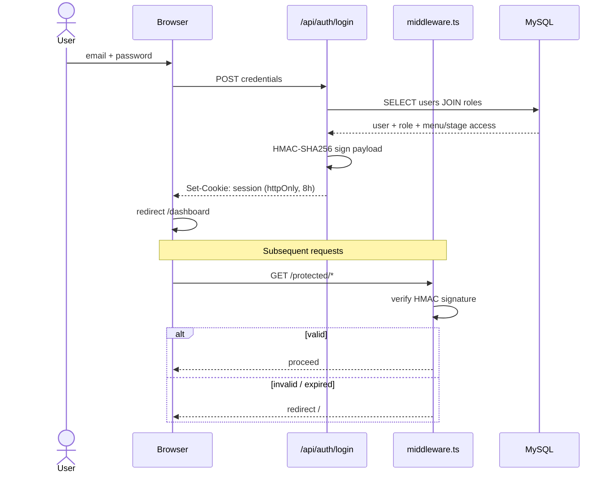

# AYRES CRM — Sistem Manajemen Produksi Apparel

Sistem manajemen produksi dan CRM berbasis web untuk bisnis manufaktur apparel/jersey. Mengelola seluruh alur kerja dari **lead → order → work order → 12 tahap produksi → pengiriman**, dengan role-based access control, tracking publik untuk customer, dan mode tema terang/gelap.

---

## Daftar Isi

1. [Tech Stack](#tech-stack)
2. [Arsitektur Sistem](#arsitektur-sistem)
3. [Fitur Utama](#fitur-utama)
4. [Flow Diagrams](#flow-diagrams)
5. [Role & Akses](#role--akses)
6. [Database](#database)
7. [API Reference](#api-reference)
8. [Setup & Instalasi](#setup--instalasi)
9. [Struktur Proyek](#struktur-proyek)
10. [Logika Bisnis](#logika-bisnis)
11. [Tema (Dark/Light Mode)](#tema-darklight-mode)
12. [License](#license)

---

## Tech Stack

| Layer | Teknologi | Versi |
|-------|-----------|-------|
| Framework | Next.js (App Router) | 16.1.6 |
| UI Library | React | 19.2.3 |
| Language | TypeScript | 5.x |
| Styling | Tailwind CSS | 4.x |
| Database | MySQL | via `mysql2` 3.20 |
| Auth | HMAC-SHA256 signed cookie | — |
| PDF Export | `jspdf` + `jspdf-autotable` | 4.2 / 5.0 |
| Excel Export | `xlsx-js-style` | 1.2 |
| Canvas → PDF | `html2canvas` | 1.4 |

---

## Arsitektur Sistem

```
┌────────────────────────────────────────────────────────────────┐
│                         BROWSER (React)                        │
│  ┌─────────────┐   ┌──────────────┐   ┌────────────────────┐   │
│  │ AuthProvider│ → │ ThemeProvider│ → │ Protected Layouts  │   │
│  └─────────────┘   └──────────────┘   └────────────────────┘   │
│            │              │                    │               │
│            ▼              ▼                    ▼               │
│  ┌──────────────────────────────────────────────────────────┐  │
│  │  lib/api-db.ts  (dbGet / dbCreate / dbUpdate / dbDelete) │  │
│  └──────────────────────────────────────────────────────────┘  │
└────────────────────────────┬───────────────────────────────────┘
                             │ fetch
                             ▼
┌────────────────────────────────────────────────────────────────┐
│                    NEXT.JS API ROUTES                          │
│  /api/auth/*       /api/db/[table]      /api/wo/update-status  │
│  /api/roles        /api/upload          /api/tracking          │
│                                                                │
│  middleware.ts → verifikasi HMAC cookie sebelum hit route      │
└────────────────────────────┬───────────────────────────────────┘
                             │ mysql2
                             ▼
┌────────────────────────────────────────────────────────────────┐
│                    MySQL (29 tabel)                            │
│  Auth · Master · Order · Work Order · Produksi · Inventaris    │
└────────────────────────────────────────────────────────────────┘
```

**Prinsip inti**:
- Seluruh data bisnis **terhubung ke MySQL** (tidak ada mock/localStorage untuk data persistent).
- Client tidak pernah query DB langsung — selalu via `/api/db/[table]` yang punya **whitelist** tabel dan kolom.
- Session-cookie HMAC disahkan setiap request via `middleware.ts`.

---

## Fitur Utama

### 🔐 Auth & Session
- Login berbasis email + password (disimpan hashed)
- Session cookie HMAC-SHA256, TTL 8 jam, httpOnly
- Middleware memproteksi semua route `(protected)/*`
- Role mapping: `admin` / `cs` / `produksi` + menu/stage access granular

### 📊 Dashboard (`/dashboard`)
- Total pendapatan, jumlah order, pending, WO aktif, WO terlambat
- Daftar order terbaru & order berisiko tinggi
- Quick link ke pembuatan order dan master data

### 📝 Orders (`/orders`)
- CRUD order lengkap dengan multi-item support
- Wilayah Indonesia otomatis (provinsi → kabupaten → kecamatan → desa via API emsifa)
- **Detail Bahan** per order (bagian badan × bahan kain)
- Filter berdasarkan status + tab bulan + pagination
- Risk level badge (SAFE, NORMAL, NEAR, HIGH, OVERDUE)
- Promo attachment per order
- Detail order dengan progress bar 12 tahap
- Export PDF laporan mingguan & bulanan

### 🛠️ Work Orders (`/work-orders`)
- Generate WO otomatis dari order (format: `WO[MMDD]-[NNN]`)
- Tracking link publik otomatis di-embed ke order
- **5 tab per WO**:
  - **Detail** — info dasar + BAHAN table + progress bar 12 tahap
  - **WO 1** — Lembar Spesifikasi (design image, pattern image, aksesoris, detail bahan auto-prefill dari order)
  - **WO 2** — Form Permintaan Gudang (bahan utama + aksesoris + material tambahan + warna + kuantitas)
  - **WO 3** — Detail Order Items per pemain (nama, NP, size, keterangan, penjahit)
  - **WO 4** — Checklist Pengiriman dengan item bonus
- PDF export untuk WO 1 (lembar spesifikasi full), WO 2 (form gudang + kotak Approval Finance), WO 3 (Excel + PDF dengan header bagian terkelompok)

### 🏭 Produksi (`/produksi`)
- Kanban board **12 tahap produksi berurutan**
- Assignment karyawan per tahap
- Akses tahap berdasarkan role (via `role_stage_access`)
- Status per WO: `BELUM` → `TERSEDIA` → `SEDANG` → `SELESAI`

### 📦 Stok & Inventaris (`/stok`)
- Tab **Stok Aktual** — list semua barang dengan qty tersedia + status
- Tab **Stok Adjustment** — riwayat penambahan/pengurangan/koreksi
- Modal Adjustment dengan validasi qty sebelum/sesudah + selisih otomatis
- Satuan: PCS, KILOGRAM, METER, ROLL, LUSIN
- Jenis otomatis dari tabel `tipe_barang`

### 📚 Master Data (`/master`)
10 entitas dengan full CRUD + pencarian:
Customer · Paket · Barang · Tipe Barang · Ukuran · Pecah Pola · Jabatan · Karyawan · Promo · Leads

**Leads** ter-tracking dari sumber: Instagram · WhatsApp · Facebook · Referral · Website · Lainnya
**Jenis CS**: CS Eksternal · Reseller · Agen

### 📈 Laporan (`/laporan`)
- **Laporan Produksi** — progress per tahap dengan date-range picker
- **Laporan Penggunaan Bahan** — konsumsi material per periode

### ⚙️ Setting (`/setting`)
- Manajemen user & role
- Menu access control per role (checklist 8 menu utama)
- Stage access control per role (checklist 12 tahap produksi)
- Placeholder integrasi WhatsApp

### 🌐 Tracking Publik (`/tracking/[noWo]`)
- Halaman tanpa login untuk customer cek progress pesanan
- Akses via tracking link yang auto-generated di order

### 🌓 Theme Toggle
- Dark mode (default, tema original)
- Light mode (putih, berdasarkan [data-theme] CSS overrides)
- Tombol toggle di sidebar, preference tersimpan di `localStorage`

---

## Flow Diagrams

### 1. Alur Login & Session



### 2. Alur Order → Work Order → Produksi

```mermaid
flowchart LR
    A[Buat Order] -->|status: PENDING| B[Konfirmasi Order]
    B -->|status: CONFIRMED| C[Buat Work Order]
    C -->|auto-prefill detail bahan| D[WO 1: Spesifikasi]
    D --> E[WO 2: Permintaan Gudang]
    E --> F[WO 3: Detail Item Pemain]
    F --> G[12 Tahap Produksi]
    G -->|semua SELESAI| H[WO 4: Pengiriman]
    H -->|status: DONE| I[Selesai]

    style A fill:#dbeafe,stroke:#1e40af
    style I fill:#d1fae5,stroke:#065f46
```



### 3. Alur Data Detail Bahan

Detail bahan dibuat sekali di order, lalu mengalir otomatis ke seluruh tahapan:

```
Order Form (create-order-drawer)
    │ DEFAULT_BAGIAN: FRONT BODY, BACK BODY, SLEEVE, COMBINATION,
    │                 COLLAR, SLEEVE ENDS, SIDE PANTS STRIPE, PANTS
    ▼
[order_detail_bahan] ─────────────┐
    │                             │
    ├──► Edit WO dialog           │
    ├──► WO Detail BAHAN table    │
    └──► Buat Lembar Spesifikasi  │
              (auto-prefill)      │
                   │              │
                   ▼              │
         [wo_spesifikasi_bahan]   │
                   │              │
                   ├──► WO 1 PDF  │
                   ├──► WO 2 Form Permintaan Gudang
                   └──► WO 3 PDF (header terkelompok: BD | BB | LENGAN(KANAN/KIRI) | VAR SAMPING(BD/BB) | KERAH | ...)
```

### 4. Status Transitions

**Order status**:
```
PENDING ──► CONFIRMED ──► IN_PROGRESS ──► DONE
   │             │
   └────── CANCELLED ─────┘
```

**Work Order status**:
```
PENDING ──► PROSES_PRODUKSI ──► SELESAI
                 │
                 └──► TERLAMBAT (deadline terlewat)
```

**Stage status per WO (table `wo_progress`)**:
```
BELUM ──► TERSEDIA ──► SEDANG ──► SELESAI
```

### 5. 12 Tahap Produksi

```
  1. Proofing ──► 2. Printing Layout ──► 3. Approval Layout ──► 4. Printing Process
       │                                                                │
       └─────────────────────────── quality gates ──────────────────────┘
                                         │
  5. Sublim Press ──► 6. QC Panel ──► 7. Potong Kain ──► 8. QC Cutting
                                                              │
                                                              ▼
  9. Jahit ──► 10. QC Jersey ──► 11. Finishing ──► 12. Pengiriman
```

---

## Role & Akses

| Fitur | Admin | CS | Produksi |
|-------|:-----:|:--:|:--------:|
| Dashboard | ✅ | ❌ | ❌ |
| Lihat order | ✅ | ✅ | ✅ |
| Input order baru | ✅ | ✅ | ❌ |
| Edit order | ✅ | ✅ | ❌ |
| Kelola work order | ✅ | ✅ | ❌ |
| Update progress produksi | ❌ | ❌ | ✅ |
| Stok & inventaris | ✅ | ❌ | ❌ |
| Master data | ✅ | ❌ | ❌ |
| Laporan & export PDF | ✅ | ❌ | ❌ |
| Setting & manajemen user | ✅ | ❌ | ❌ |

Role dan akses disimpan granular di DB (`roles`, `role_menu_access`, `role_stage_access`) — admin bisa custom akses per role lewat halaman `/setting`.

---

## Database

**29 tabel**, dikelompokkan:

### Auth & RBAC (4)
| Tabel | Fungsi |
|-------|--------|
| `roles` | Definisi role (admin/cs/produksi/custom) |
| `users` | Login credentials + role_id |
| `role_menu_access` | Menu apa saja yang bisa diakses per role |
| `role_stage_access` | Tahap produksi apa saja yang bisa diakses per role |

### Master Data (10)
| Tabel | Fungsi |
|-------|--------|
| `customers` | Data customer (nama, alamat lengkap per level wilayah) |
| `paket` | Katalog paket produk |
| `barang` | Katalog bahan/material |
| `tipe_barang` | Kategori bahan (Kain, Aksesoris, dll) |
| `ukuran` | Ukuran pakaian |
| `pecah_pola` | Template pecah pola + inisial |
| `jabatan` | Role internal karyawan |
| `karyawan` | Data karyawan + jabatan |
| `promo` | Promo periode mulai-selesai |
| `leads` | Tracking calon customer + sumber |

### Order (4)
| Tabel | Fungsi |
|-------|--------|
| `orders` | Header order (customer, nominal, DP, deadline, tracking_link) |
| `order_items` | Item order (paket, bahan kain, qty) |
| `order_detail_bahan` | Baris bagian × bahan per order |
| `order_promos` | Many-to-many order ↔ promo |

### Work Order (7)
| Tabel | Fungsi |
|-------|--------|
| `work_orders` | Header WO (no_wo, order_id, jumlah, deadline) |
| `wo_progress` | Status per stage per WO (BELUM/TERSEDIA/SEDANG/SELESAI) |
| `wo_spesifikasi` | Lembar spesifikasi WO 1 (+ dokumen desain & pattern base64) |
| `wo_spesifikasi_bahan` | Baris bagian × bahan per spesifikasi |
| `wo_permintaan_gudang` | Form gudang WO 2 (bahan utama/aksesoris/material tambahan) |
| `wo_detail_items` | Item per pemain WO 3 (nama, NP, size, penjahit) |
| `wo_pengiriman` | Checklist pengiriman WO 4 + item bonus |

### Produksi (1)
| Tabel | Fungsi |
|-------|--------|
| `production_stages` | Definisi 12 tahap produksi + urutan |

### Inventaris (2)
| Tabel | Fungsi |
|-------|--------|
| `stok` | Stok aktual per barang |
| `stok_adjustment` | Audit trail penyesuaian stok |

### Config (1)
| Tabel | Fungsi |
|-------|--------|
| `settings` | Key-value config aplikasi |

Schema lengkap: `database/ayres_crm.sql`.

---

## API Reference

Semua API terletak di `app/api/`. Middleware memproteksi seluruh endpoint kecuali `/api/auth/login` dan `/api/tracking`.

| Endpoint | Method | Fungsi |
|----------|--------|--------|
| `/api/auth/login` | POST | Login — return session cookie |
| `/api/auth/logout` | POST | Logout — clear session cookie |
| `/api/auth/session` | GET | Ambil info user dari session |
| `/api/db/[table]` | GET | List semua row dari tabel (dengan optional `?search=`) |
| `/api/db/[table]` | POST | Insert row baru |
| `/api/db/[table]` | PUT | Update row (`{ id, ...data }`) |
| `/api/db/[table]` | DELETE | Hapus row (`?id=`) |
| `/api/roles` | CRUD | Kelola role + menu_access + stage_access (transactional) |
| `/api/upload` | POST | Upload file ke `public/uploads` |
| `/api/tracking` | GET | Info progress WO untuk halaman tracking publik |
| `/api/wo/update-status` | POST | Update status stage WO (dari kanban produksi) |

### Client helper: `lib/api-db.ts`

```ts
import { dbGet, dbCreate, dbUpdate, dbDelete } from '@/lib/api-db';

const orders = await dbGet('orders');
const newId = await dbCreate('orders', { ... });
await dbUpdate('orders', id, { status: 'DONE' });
await dbDelete('orders', id);
```

Tabel yang bisa diakses: **whitelisted** di `app/api/db/[table]/route.ts` — request ke tabel yang tidak terdaftar return 400.

---

## Setup & Instalasi

### 1. Prasyarat
- Node.js 20+ dan npm
- MySQL 8.0+ (atau MariaDB 10.11+)

### 2. Clone & Install

```bash
git clone <repo-url>
cd web_crm
npm install
```

### 3. Setup Database

```bash
mysql -u root -p -e "CREATE DATABASE ayres_crm CHARACTER SET utf8mb4 COLLATE utf8mb4_unicode_ci;"
mysql -u root -p ayres_crm < database/ayres_crm.sql
```

### 4. Environment Variable

Buat file `.env.local` di root project:

```env
SESSION_SECRET=your-random-long-secret-min-32-chars
DB_HOST=localhost
DB_PORT=3306
DB_USER=root
DB_PASSWORD=
DB_NAME=ayres_crm
```

`SESSION_SECRET` wajib berupa string acak — digunakan untuk HMAC session cookie.

### 5. Jalankan

```bash
npm run dev          # Development (http://localhost:3000)
npm run build        # Production build
npm run start        # Production server
npm run lint         # ESLint check
```

### 6. Login Awal

Default admin user di schema seed (lihat `database/ayres_crm.sql` bagian `INSERT INTO users`). Ganti password setelah login pertama lewat `/setting`.

---

## Struktur Proyek

```
web_crm/
├── app/
│   ├── layout.tsx                          # Root layout + ThemeProvider + AuthProvider
│   ├── globals.css                         # Tailwind + light-mode overrides ([data-theme])
│   ├── page.tsx                            # Login page
│   ├── tracking/                           # Halaman tracking publik
│   ├── (protected)/
│   │   ├── layout.tsx                      # Sidebar + navigation + theme toggle
│   │   ├── dashboard/page.tsx              # Dashboard admin
│   │   ├── orders/
│   │   │   ├── page.tsx                    # Daftar order + filter
│   │   │   ├── [id]/page.tsx               # Detail order + Detail Bahan editor
│   │   │   └── create-order-drawer.tsx     # Drawer input order
│   │   ├── work-orders/
│   │   │   ├── page.tsx                    # Daftar WO + Edit WO dialog
│   │   │   └── [id]/page.tsx               # Detail + WO 1/2/3/4 tabs + PDF export
│   │   ├── produksi/page.tsx               # Kanban 12 tahap
│   │   ├── stok/page.tsx                   # Stok Aktual + Stok Adjustment tabs
│   │   ├── master/page.tsx                 # Master data 10 entitas (tab switcher)
│   │   ├── laporan/
│   │   │   ├── produksi/page.tsx
│   │   │   ├── penggunaan-bahan/page.tsx
│   │   │   └── date-range-picker.tsx
│   │   └── setting/page.tsx                # User + role + menu/stage access
│   └── api/
│       ├── auth/{login,logout,session}/
│       ├── db/[table]/route.ts             # Generic CRUD (whitelisted)
│       ├── roles/route.ts                  # Role management (transactional)
│       ├── tracking/route.ts               # Tracking publik
│       ├── upload/route.ts                 # File upload
│       └── wo/update-status/route.ts
├── lib/
│   ├── api.ts                              # Data mapper (DB → UI types)
│   ├── api-db.ts                           # Generic CRUD client helper
│   ├── auth-context.tsx                    # AuthProvider + useAuth hook
│   ├── theme-context.tsx                   # ThemeProvider + useTheme hook
│   ├── cache.ts                            # sessionStorage cache (30s TTL)
│   ├── constants.ts                        # Stage labels & metadata
│   ├── db.ts                               # MySQL connection pool
│   ├── session.ts                          # HMAC-SHA256 session utils
│   ├── toast.tsx                           # Toast notification system
│   ├── types.ts                            # TypeScript interfaces (Order, Progress, dll)
│   └── utils.ts                            # Helper (formatDate, compressImage,
│                                           #         computeAllocations, normBagian, dll)
├── database/
│   └── ayres_crm.sql                       # MySQL schema + seed data
├── public/
│   ├── logo/                               # Brand assets (AYRES logo)
│   └── uploads/                            # User uploads (PDF output, images)
├── middleware.ts                           # Session verification (HMAC)
├── package.json
├── tsconfig.json
├── next.config.ts
└── LICENSE
```

---

## Logika Bisnis

### Format No Work Order
Format: `WO[MM][DD]-[NNN]`
Contoh: `WO0420-001` = WO ke-1 yang dibuat tanggal 20 April

### Status Order

| Status | Kondisi |
|--------|---------|
| `PENDING` | Order baru dibuat, belum dikonfirmasi |
| `CONFIRMED` | Dikonfirmasi, siap dibuatkan WO |
| `IN_PROGRESS` | WO sudah dibuat, sedang produksi |
| `DONE` | Selesai & dikirim |
| `CANCELLED` | Dibatalkan |

### Risk Level

| Level | Kondisi | Warna |
|-------|---------|-------|
| `SAFE` | Status DONE | Hijau |
| `NORMAL` | Sisa hari > 7 | Biru |
| `NEAR` | Sisa hari 4–7 | Kuning |
| `HIGH` | Sisa hari ≤ 3 | Oranye |
| `OVERDUE` | Lewat deadline, belum DONE | Merah |

### Alur Progress Produksi
Setiap WO melewati 12 tahap secara berurutan. Status per tahap (`wo_progress.status`):
```
BELUM → TERSEDIA → SEDANG → SELESAI
```
- `TERSEDIA` berarti tahap ini sudah bisa dikerjakan (tahap sebelumnya selesai)
- Setiap transisi disimpan dengan `started_at` / `completed_at` + `karyawan_id`

### Default Bagian Detail Bahan
Saat buat order baru, sistem otomatis generate 8 baris default:
`FRONT BODY` · `BACK BODY` · `SLEEVE` · `COMBINATION` · `COLLAR` · `SLEEVE ENDS` · `SIDE PANTS STRIPE` · `PANTS`

User bisa tambah/hapus/ubah. Data ini mengalir ke:
- `order_detail_bahan` saat save order
- Auto-prefill `wo_spesifikasi_bahan` saat buat Lembar Spesifikasi WO 1
- Kolom dinamis di PDF/Excel WO 3 (dengan header terkelompok — COMBINATION → "VAR SAMPING" (BD, BB), SLEEVE → "LENGAN" (KANAN, KIRI))

### Kapasitas Produksi Harian
- `NORMAL_CAP` = 200 pcs/hari
- `EXTEND_CAP` = 100 pcs/hari (overflow)
- Minggu di-skip otomatis di scheduler (`computeAllocations` di `lib/utils.ts`)

---

## Tema (Dark/Light Mode)

Sistem tema dual-mode dengan persistensi otomatis:

- **Default**: dark mode (tema asli, navy/dark slate)
- **Light mode**: putih/abu muda dengan kontras terbaca
- Toggle via tombol di sidebar (ikon matahari/bulan)
- Preference tersimpan di `localStorage.theme`
- Pre-hydration script di `<head>` mencegah flash-of-wrong-theme saat reload

**Implementasi**:
- `lib/theme-context.tsx` — React context + `useTheme` hook
- Atribut `data-theme="dark|light"` diset ke `<html>`
- `app/globals.css` — comprehensive CSS overrides dengan selector `[data-theme="light"]` untuk semua arbitrary Tailwind color classes (`bg-[#111827]`, `text-white/40`, `border-white/[0.06]`, dll.)

Tambah komponen baru tidak perlu tulis class khusus light mode — override CSS global sudah cover semua pola warna yang dipakai di codebase.

---

## Troubleshooting

**Build error "Module not found: mysql2"** → jalankan `npm install` ulang.
**Cookie session hilang setelah reload** → cek `SESSION_SECRET` di `.env.local` tidak berubah antar restart.
**Wilayah Indonesia tidak muncul** → butuh koneksi internet (API `emsifa/api-wilayah-indonesia`).
**Excel export tidak berwarna** → pastikan `xlsx-js-style` sudah terinstall (bukan `xlsx` biasa).
**PDF blank / render rusak** → cek browser console; `html2canvas` butuh gambar yang CORS-compliant.

---

## License

Proyek ini dilisensikan di bawah [MIT License](LICENSE).

---

<sub>Dibangun dengan Next.js 16 · React 19 · Tailwind 4 · MySQL · TypeScript</sub>
